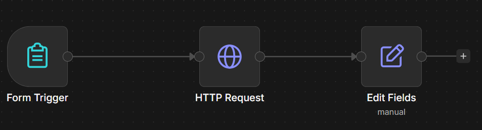
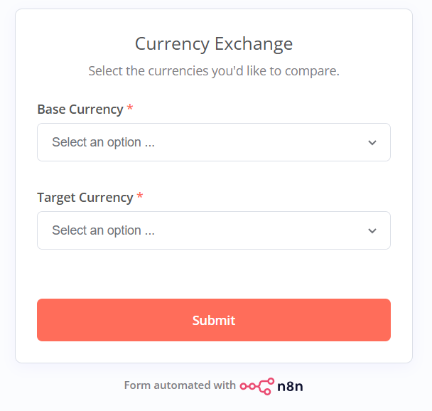
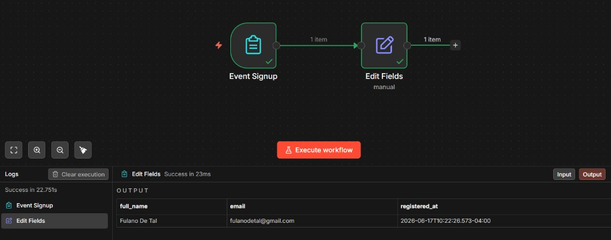

# Workflows Automation with n8n

[](https://github.com/fariasangelica/workflows-automation-with-n8n/actions/workflows/validate-workflows.yml)

n8n workflow exports stored as JSON in [`workflows/`](workflows/).

## Workflows

| Workflow | File | Description |
|----------|------|-------------|
| Currency Exchange | [`currency-exchange.json`](workflows/currency-exchange.json) | Form + exchange rate lookup |
| Event Signup | [`event-signup.json`](workflows/event-signup.json) | Self-service event registration form |

### Currency Exchange

Form to pick base/target currencies and fetch the rate from [open.er-api.com](https://open.er-api.com/).

```
Form Trigger → HTTP Request → Edit Fields
```





### Event Signup

Self-service form for Acme event attendees — collects first name, last name, and email, then outputs a clean registration record.

```
Event Signup (Form Trigger) → Edit Fields
```

**Output:** `full_name`, `email`, `registered_at`



## Contributing

See [CONTRIBUTING.md](CONTRIBUTING.md).

## License

[MIT](LICENSE)
